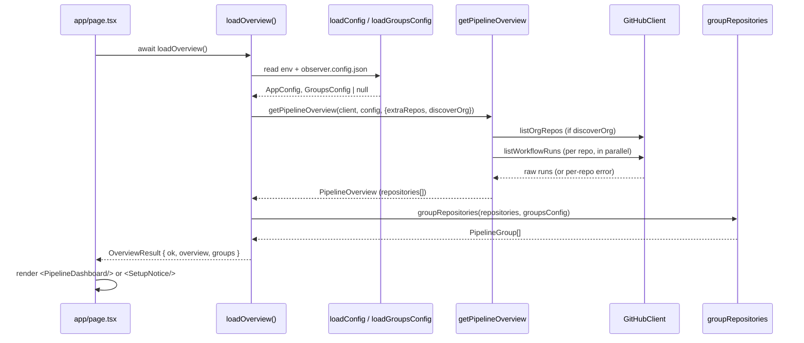

# Architecture

Observer is organised in **layers** with a strict dependency direction, so that
successive additions stay localised and easy to reason about. This document is
the map; follow the links for details.

Related: [domain-model.md](./domain-model.md) ·
[github-integration.md](./github-integration.md) · [ui.md](./ui.md) ·
[configuration.md](./configuration.md)

## Layers and dependency rules

Dependencies point **downward only**. A layer may import from layers below it,
never above.

```
app/  (Next.js route, server component)
  └── components/  (presentation, renders domain types)
        └── lib/pipelines/  (domain model + aggregation + composition root)
              ├── lib/config/    (configuration parsing/validation)
              ├── lib/github/    (typed REST client, raw payloads)
              └── lib/format/    (pure formatting helpers)
```

| Layer                                                     | Responsibility                                                     | May import                        | Must NOT                                   |
| --------------------------------------------------------- | ------------------------------------------------------------------ | --------------------------------- | ------------------------------------------ |
| [`src/lib/github`](../src/lib/github)                     | HTTP only: auth, query building, error mapping, caching, API types | `config` (types only)             | Know about the domain model or the UI      |
| [`src/lib/config`](../src/lib/config)                     | Parse & validate env + `observer.config.json`                      | `github` (types only)             | Perform network I/O                        |
| [`src/lib/pipelines`](../src/lib/pipelines)               | Domain model, mapping, aggregation, grouping, composition root     | `config`, `github`, `format`      | Import from `components`/`app`             |
| [`src/lib/format`](../src/lib/format)                     | Pure, presentation-agnostic formatting                             | (nothing)                         | Depend on domain or UI                     |
| [`src/components`](../src/components)                     | Render domain types into HTML                                      | `lib/*`                           | Call GitHub directly                       |
| [`src/app`](../src/app)                                   | Compose (`loadOverview`) and render                                | `lib/pipelines`, `components`     | Contain business logic                     |

**Key boundary:** `github/` returns *raw* GitHub payloads; translation into the
UI-agnostic domain model happens in `pipelines/` (see
[`mappers.ts`](../src/lib/pipelines/mappers.ts)). This means the client can
evolve without touching the UI, and vice versa.

## Module map

| Module                                                              | What it holds                                                                 | Doc                                              |
| ------------------------------------------------------------------- | ----------------------------------------------------------------------------- | ------------------------------------------------ |
| [`lib/github/client.ts`](../src/lib/github/client.ts)               | `GitHubClient` — REST calls (`listOrgRepos`, `listWorkflowRuns`)              | [github-integration.md](./github-integration.md) |
| [`lib/github/types.ts`](../src/lib/github/types.ts)                 | Raw GitHub API typings + `RepoRef`                                            | [github-integration.md](./github-integration.md) |
| [`lib/github/errors.ts`](../src/lib/github/errors.ts)               | `GitHubApiError` (carries HTTP status)                                        | [github-integration.md](./github-integration.md) |
| [`lib/github/repo.ts`](../src/lib/github/repo.ts)                   | `repoFullName`, `repoRefKey` (dedup/lookup key)                              | [domain-model.md](./domain-model.md)             |
| [`lib/config/index.ts`](../src/lib/config/index.ts)                 | `AppConfig`, `loadConfig`, `resolveRepoEntry`, `ConfigError`                 | [configuration.md](./configuration.md)           |
| [`lib/config/groups.ts`](../src/lib/config/groups.ts)               | `observer.config.json` loader (`GroupsConfig`, `loadGroupsConfig`)           | [configuration.md](./configuration.md)           |
| [`lib/pipelines/types.ts`](../src/lib/pipelines/types.ts)           | Domain types (`PipelineRun`, `RepoPipelines`, …)                            | [domain-model.md](./domain-model.md)             |
| [`lib/pipelines/mappers.ts`](../src/lib/pipelines/mappers.ts)       | GitHub → domain projection + status normalisation                            | [domain-model.md](./domain-model.md)             |
| [`lib/pipelines/service.ts`](../src/lib/pipelines/service.ts)       | Repo resolution + parallel fetch with fault isolation                        | this doc (Data flow)                             |
| [`lib/pipelines/grouping.ts`](../src/lib/pipelines/grouping.ts)     | Partition repos into folders (`PipelineGroup`)                               | [configuration.md](./configuration.md)           |
| [`lib/pipelines/summary.ts`](../src/lib/pipelines/summary.ts)       | Status counts (`summarizeRepositories`)                                      | [domain-model.md](./domain-model.md)             |
| [`lib/pipelines/index.ts`](../src/lib/pipelines/index.ts)           | **Composition root** `loadOverview` + barrel exports                         | this doc (Data flow)                             |
| [`components/*`](../src/components)                                  | Dashboard UI                                                                  | [ui.md](./ui.md)                                 |

## Data flow (request → render)

The composition root is
[`loadOverview()`](../src/lib/pipelines/index.ts). It is the single place where
configuration, the GitHub client, and aggregation are wired together.



Important properties:

- **Config problems are data, not exceptions.** `loadOverview` returns
  `{ ok: false, reason: "config", message }` for missing/invalid configuration;
  the page renders [`SetupNotice`](../src/components/SetupNotice.tsx) instead of
  crashing. Unexpected errors propagate to Next's error boundary.
- **Per-repository fault isolation.** One repo failing to fetch never fails the
  whole overview — the error is captured on that repo's `RepoPipelines.error`
  (see [`service.ts`](../src/lib/pipelines/service.ts) `fetchRepoPipelines`).
- **Parallel fetch.** Workflow runs for all repos are fetched with
  `Promise.all`.
- **Efficiency.** When ungrouped repos are hidden
  (`includeUngrouped: false`), organisation discovery is skipped
  (`discoverOrg: false`) so no API calls are wasted on filtered-out repos.

## Rendering flow

[`page.tsx`](../src/app/page.tsx) is a `force-dynamic` async server component.
It calls `loadOverview()` and hands the result to the UI. See the component tree
in [ui.md](./ui.md).

```
page.tsx
 ├─ SetupNotice                 (when config is missing/invalid)
 └─ PipelineDashboard
     ├─ StatusSummary           (header counts, visible repos only)
     ├─ RepoGrid                (flat view — no observer.config.json)
     └─ RepoGroupSection*       (folder view — one <details> per group)
         └─ RepoGrid → RepoPipelineCard*
```

## Where to make a change

| Change                                | Primary file(s)                                                                                 |
| ------------------------------------- | ----------------------------------------------------------------------------------------------- |
| New GitHub endpoint / field           | [`github/client.ts`](../src/lib/github/client.ts), [`github/types.ts`](../src/lib/github/types.ts) |
| New displayed run field               | [`pipelines/types.ts`](../src/lib/pipelines/types.ts) + [`mappers.ts`](../src/lib/pipelines/mappers.ts) + [`RepoPipelineCard.tsx`](../src/components/RepoPipelineCard.tsx) |
| Grouping / folder behavior            | [`config/groups.ts`](../src/lib/config/groups.ts) + [`pipelines/grouping.ts`](../src/lib/pipelines/grouping.ts) |
| New config value                      | [`config/index.ts`](../src/lib/config/index.ts) (+ `.env.example`)                              |
| Composition / new data source         | [`pipelines/index.ts`](../src/lib/pipelines/index.ts)                                            |

Step-by-step recipes are in [how-to.md](./how-to.md).
